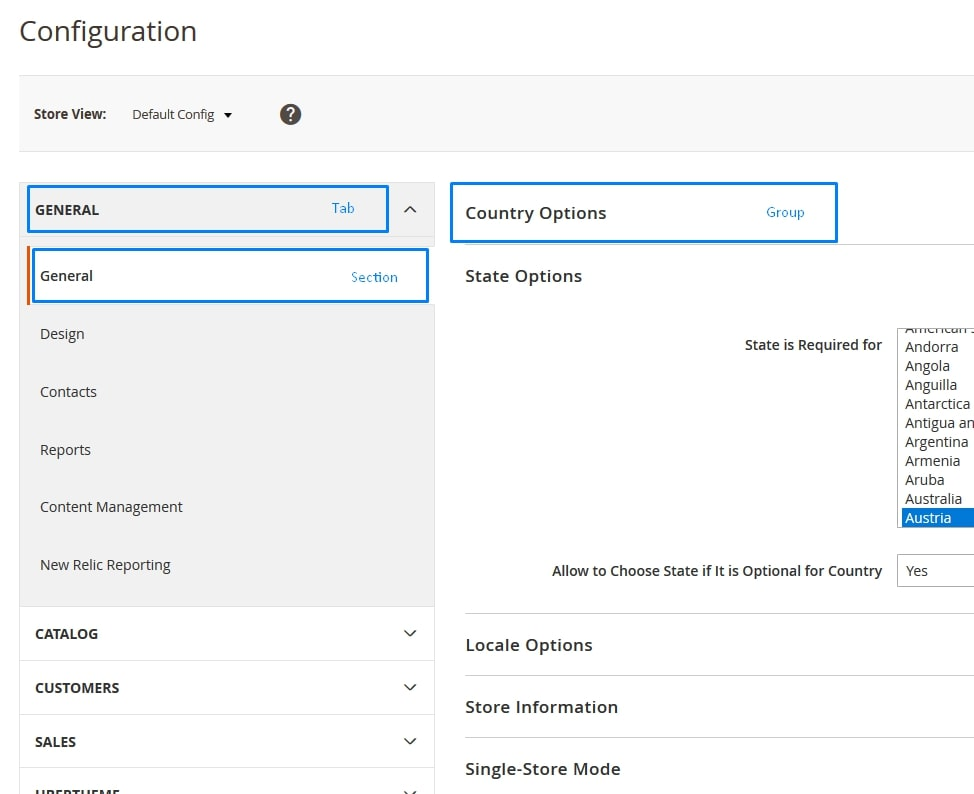

# Section 5: Developing with Adminhtml (11%)

## 5.1 Create a controller for an admin router

---

> ### 5.1.1 How would you create an admin controller?
 
Create controller file `Controller/Adminhtml/HelloWorld/Index.php`

This file is the class assigned to the default `Index` action for the `HelloWorld` controller. Since the admin area 
serves this page, the file belongs in the `Adminhtml` directory, and the class itself 
extends `\Magento\Backend\App\Action`

Source: https://devdocs.magento.com/guides/v2.4/ext-best-practices/extension-coding/example-module-adminpage.html#page-controller

---

> ### 5.1.2 How do you ensure the right level of security for a new controller?

We can restrict the access to admin controllers by overriding the `_isAllowed` method of 
the `\Magento\Backend\App\Action` class.

Add the following to your module’s `Controller/Adminhtml/HelloWorld/Index.php` file:

```php
protected function _isAllowed()
{
    return $this->_authorization->isAllowed('Vendor_MyModule::somesection');
}
```

If the user does not have permission, the action page displays an “Access Denied” message.

Source: https://devdocs.magento.com/guides/v2.4/ext-best-practices/tutorials/create-access-control-list-rule.html#restrict-admin-controllers

---

## 5.2 Define basic terms and elements of system configuration, including scopes, website, store, store view

> ### 5.2.1 Overview

Magento 2 allows to extend the system configuration with modules and integrate the custom module configuration into 
the Magento 2 system menu.

To add such custom configurations, use `<module_dir>/etc/adminhtml/system.xml` file.

Configuration consists of 3 parts:
1. Tab
2. Section
3. Group



---

> ### 5.2.2 How would you add a new system configuration option?

**Adding a tab**

```xml
<tab id="custom_tab" translate="label" sortOrder="100">
    <label>Custom Tab</label>
</tab>
```

**Adding a section**

```xml
<section id="custom_section" translate="label" type="text" sortOrder="100" showInDefault="1" showInWebsite="1" showInStore="1">
    <label>Custom Config Section</label>
    <tab>custom_tab</tab>
    ...
</section>
```

**Adding a group**

```xml
<group id="custom_group" translate="label" type="text" sortOrder="10" showInDefault="1" showInWebsite="1" showInStore="1">
    <label>General</label>
    ...
</group>
```

**Scopes**

`showInDefault="1"`, `showInWebsite="1"` and `showInStore="1""` parameters set the scope where our section will be displayed.

---

> ### 5.2.3 What is the difference in this process for different option types (secret, file)?

**Simple Text Field**

```xml
<field id="custom_text" translate="label" type="text" sortOrder="20" showInDefault="1" showInWebsite="1" showInStore="1">
    <label>Custom Text</label>
</field>
```

**Yes/No Dropdown**

```xml
<field id="yesno_dropdown" translate="label" type="select" sortOrder="10" showInDefault="1" showInWebsite="1" showInStore="1">
    <label>Custom Yes/No Dropdown</label>
    <source_model>Magento\Config\Model\Config\Source\Yesno</source_model>
</field>
```

**Dropdown With The Custom Source model**

```xml
<field id="custom_dropdown" translate="label" type="select" sortOrder="10" showInDefault="1" showInWebsite="1" showInStore="1">
    <label>Dropdown with custom source model example</label>
    <source_model>Vendor\Module\Model\Config\Source\Custom</source_model>
</field>
```

And our custom model can look like this:

`<module_dir>/Model/Config/Source/Custom.php`

```php
<?php
 
namespace Vendor\Model\Model\Config\Source;
 
class Custom implements \Magento\Framework\Option\ArrayInterface
{
    /**
     * @return array
     */
    public function toOptionArray()
    {
 
        return [
            ['value' => 0, 'label' => __('Zero')],
            ['value' => 1, 'label' => __('One')],
            ['value' => 2, 'label' => __('Two')],
        ];
    }
}
```

**File Upload**

```xml
<field id="logo" translate="label" type="image" sortOrder="30" showInDefault="1" showInWebsite="1" showInStore="1">
    <label>Custom Image</label>
    <backend_model>Magento\Config\Model\Config\Backend\Image</backend_model>
    <upload_dir config="system/filesystem/media" scope_info="1">logo</upload_dir>
    <base_url type="media" scope_info="1">logo</base_url>
    <comment><![CDATA[Allowed file types: jpeg, gif, png.]]></comment>
</field>
```

**Dependent Field**

```xml
<field id="depends_example" translate="label" type="text" sortOrder="40" showInDefault="1" showInWebsite="1" showInStore="1">
    <label>Dependant text field example with validation</label>
    <depends>
        <field id="*/*/yesno_dropdown">1</field>
    </depends>
    <validate>validate-no-empty</validate>
</field>
```

`<validate>validate-no-empty</validate>` validates that the field is not empty when the configuration is saved.

`depends` tag allows to display this field only if at `yesno_dropdown` the `Yes` value was selected.

**Textarea**

```xml
<field id="custom_textarea" translate="label" type="textarea" sortOrder="50" showInDefault="1" showInWebsite="1" showInStore="1">
    <label>Custom Textarea</label>
</field>
```

**Secret Field**

```xml
<field id="custom_secret" type="obscure" translate="label" sortOrder="70" showInDefault="1" showInWebsite="1" showInStore="1">
    <label>Custom Secret Field</label>
    <backend_model>Magento\Config\Model\Config\Backend\Encrypted</backend_model>
</field>
```

`type="obscure"` hides field’s value from the frontend, but the information from it will still be saved as plain text. 
Setting `Magento\Config\Model\Config\Backend\Encrypted` as a backend model allows to encrypt the data in the database.

Most of the source models are located in `app/code/Magento/Config/Model/Config/Source` and backend models are located 
in `app/code/Magento/Config/Model/Config/Backend`.

Source: https://belvg.com/tutorial/magento-2-certified-professional-developer-guide-section-6

---

## 5.3 Define / identify basic terms and elements of ACL

---

> ### 5.3.1 Overview

ACL stands for Access Control lists. These are used in Magento to authenticate users to use the admin also web API's.

These are configured in the `adminhtml.xml` files of the modules.

There are 3 parts to ACL:

1. **Resources** - Individual parts of the system.
2. **Roles** - The roles accessible to a user.
3. **Users** - The user who is assigned a role.

---

> ### 5.3.2 How would you add a new ACL resource to a new entity?

Your controller in the admin application must implement an `_isAllowed()` method or const `ADMIN_RESOURCE` which 
determines if a user can access the URL endpoint.

---

> ### 5.3.3 How do you manage the existing ACL hierarchy?

By editing `etc/acl.xml`. `sorOrder` defines the position where the option is displayed in the menu.

```xml
<acl>
    <resources>
        <resource id="Magento_Backend::admin">
            <resource id="Magenest_HelloWorld::helloworld" title="Hello World" sortOrder="51">
                <resource id="Magenest_HelloWorld::post" title="Manage Post" sortOrder="10"/>
                <resource id="Magenest_HelloWorld::helloworld_configuration" title="Configuration" sortOrder="99" />
            </resource>
            <resource id="Magento_Backend::stores">
                <resource id="Magento_Backend::stores_settings">
                    <resource id="Magento_Config::config">
                        <resource id="Magenest_HelloWorld::helloworld_config" title="Hello World"/>
                    </resource>
                </resource>
            </resource>
        </resource>
    </resources>
</acl>
```

---

## 5.4 Set up a menu item

---

> ### 5.4.1 How do you add a new menu item to a given tab?

Adminhtml menu items are configured in `etc/adminhtml/menu.xml`. To add a new menu item, edit this file:

```xml
<config xmlns:xsi="http://www.w3.org/2001/XMLSchema-instance"
        xsi:noNamespaceSchemaLocation="urn:magento:module:Magento_Backend:etc/menu.xsd">
   <menu>
       <add id="Your_Module::brief_module_description"
           title="Your Menu Tab Title"
           translate="title"
           module="Your_Module"
           sortOrder="10"
           
           <!-- No parent means the tab appears in the side bar -->
           parent="Magento_Catalog::inventory"
           
           <!-- No action means the item acts as a header -->
           action="path/to/your/controller"
           
           <!-- ID of the ACL entry that validates permissions -->
           resource="ACL_Entry_ID"
           />
   </menu>
</config>
```

---

> ### 5.4.2 How do you add a new tab to the Admin menu?

Do not specify a `parent` attribute in the `<add>` node.

---

## 5.5 Create appropriate permissions for users

---

> ### 5.5.1 How are menu items related to ACL permissions?
 
Menu items are not shown to users with insufficient permissions to access them.

---

> ### 5.5.2 How do you add a new user with given set of permissions?

Navigate to `System > Permissions > All Users` in Magento admin, add a new user, and set their role under 
`User Information > User Role`.

This can also be done programmatically:

```php
$user = $this->userFactory->create();
$user->setData(
    [
        'username'          => 'user.name',
        'firstname'         => 'Forename',
        'lastname'          => 'Surname',
        'email'             => 'admin@test.com',
        'password'          => 'badpassword123',       
        'is_active'         => 1
    ]
);

$user->setRoleId(1);
$user->save();
```

---